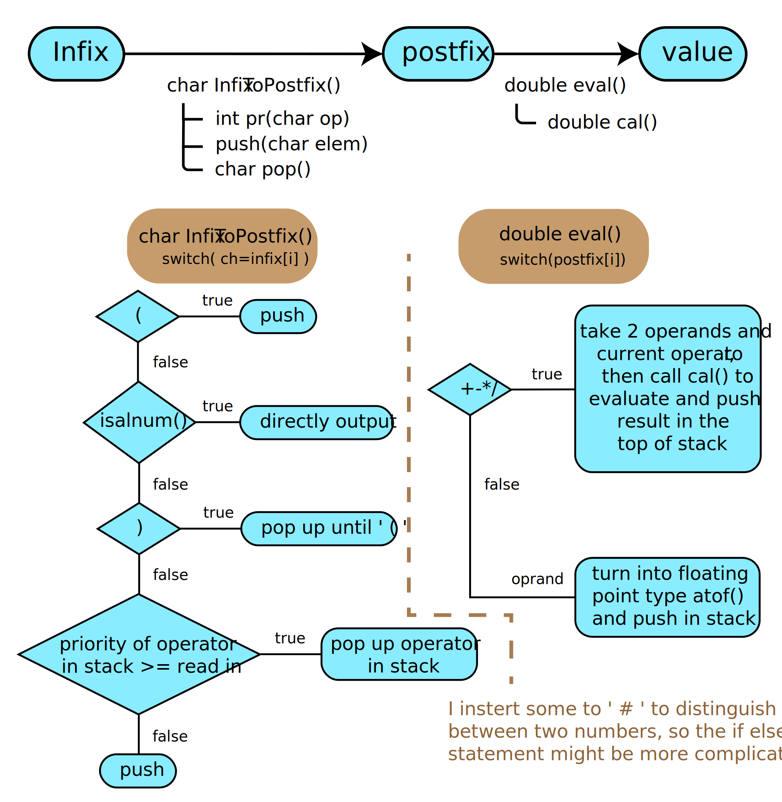
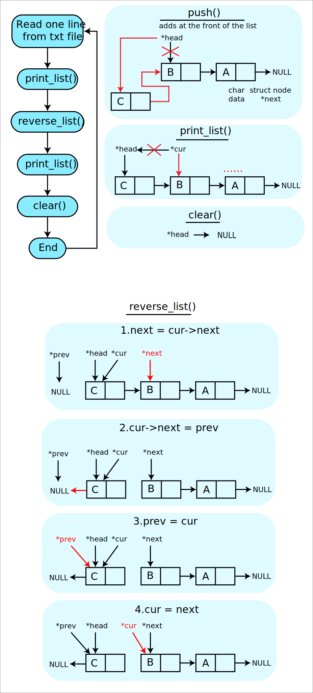
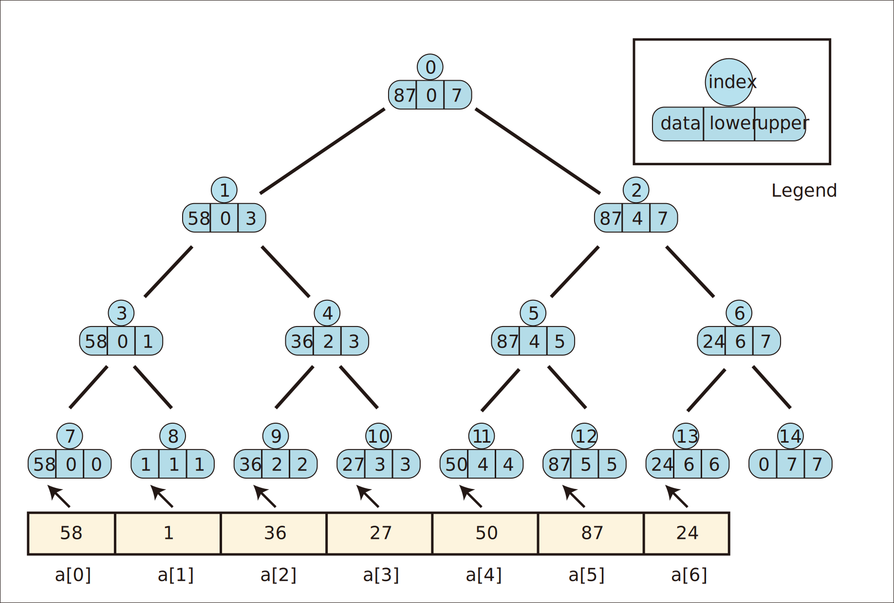
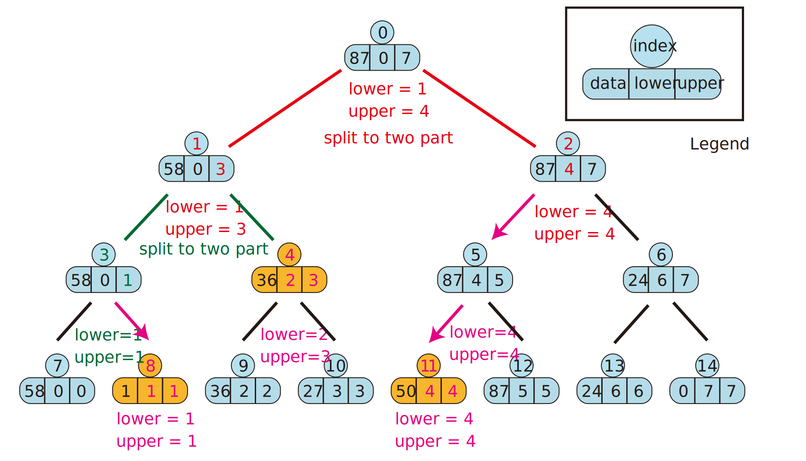
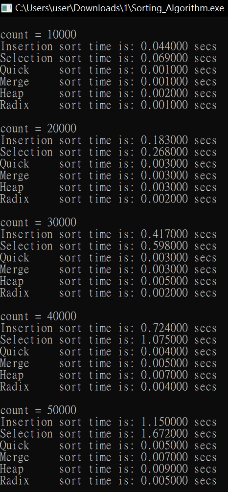
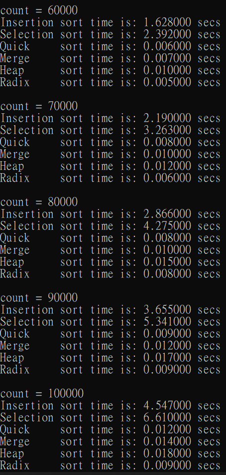
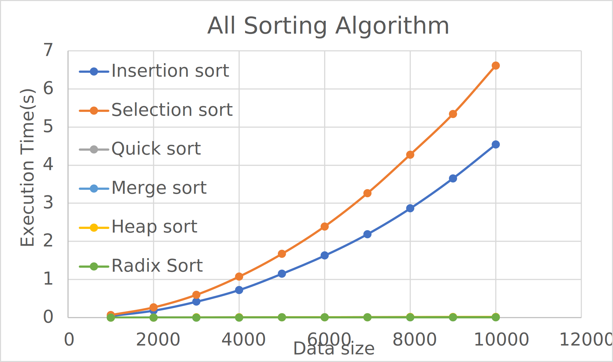
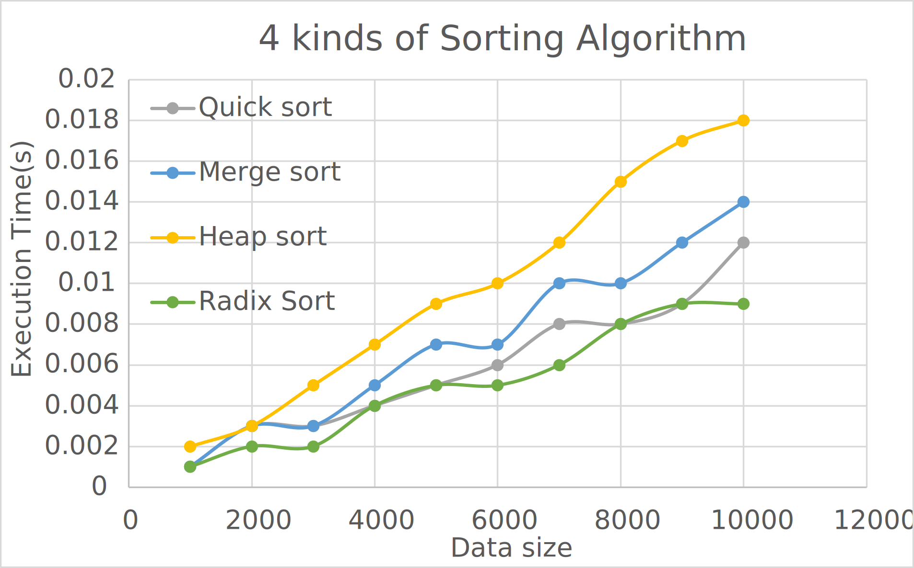
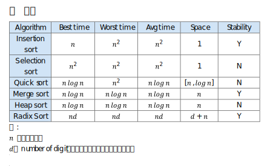

# Data Structures
Time : 2021 spring (second half semester of sophomore)

## lecture

|subject|teacher|
|:-:|:-:|
|[資料結構](http://class-qry.acad.ncku.edu.tw/syllabus/online_display.php?syear=0109&sem=2&co_no=E231601&class_code=1)|[戴顯權](https://www.ee.ncku.edu.tw/teacher/index2.php?teacher_id=35)|

<br>

## Report
> more info in doc/*.docx
- [hw1](#hw1)
- [hw2](#hw2)
- [hw3](#hw3)
- [hw4](#hw4)

<br>

## Environment
1. OS
- `Windows 10 21H1`

<br>

## How to Run
1. download repo
```
git clone https://github.com/HsuChiChen/data-structures.git
```
2. generate `*.exe` file
3. feed `exe` file with testing `txt` file
```
*.exe < *.txt
```

<br>

## hw1
### 功能
使用Stack的資料結構型態來實現計算機包含加、減、乘、除之功能。
|input|output|
|:-:|:-:|
|`12+8*13+(5+7)/4`|`Result = 119.000000`|

### 流程圖


### 心得
學會定義stack的資料結構，並賦予其`pop()`與`push()`的功能，實作四則運算器。
- infix轉postfix<br>
**運算子**()+-*/ push進或pop出stack
- postfix轉value<br>
把**運算元**1、14、22…. push進或pop出stack

## hw2
### 功能
輸入一串字符，依序建立linked list。之後輸出該linked list與反轉的linked list。

|input|output|
|:-:|:-:|
|`abcdefg`|`gfedcba`|

### 流程圖


### 心得
學會定義`linked list`的資料結構，並賦予其`push()`、`reverse()`、`printf()`與`clear()`的功能，實現單個字串反轉功能，重點為實作reverse_list() 我令三個指標分別為 `*prev`, `*ast cur`, `*ast next` ，不斷去做iteration，直到`current node == NULL`，把head指標移到原本最後的字串，即完成linked list反轉。

## hw3
### 功能
給定一組array，在`[x1, x2]`的範圍中找到最大值。

|input|output|
|:-:|:-:|
|`7, 1 4`|`50 in time seed`|

### 流程圖



### 心得
為找候選節點的詳細流程，我的程式共分4種狀況。
- range介在兩者之間<br>
Split to 2 parts
- upper<=右下 孩子節點的上界<br>
go to left tree
- lower>右下 孩子節點的上界<br>
go to right tree
- 上下界皆符合<br>
hit the range and push in Stack

採用recursive call的寫法，因為在上述情況一range介在兩者之間，會**增生**。另外因為不知道有幾個候選節點，所以用stack去存。

## hw4
### 功能
分析每種sorting方式的優缺點，並做圖。
- Insertion sort
- Selection sort
- Quick sort
- Merge sort
- Heap sort
- Radix Sort

### 結果
<center class="half">
    
</center>





### 心得
在網路上看到各式各樣的sorting，了解到各種sorting的優缺點與使用時機
像`Insert sort`雖然時間複雜度大但適用於資料量小或是已經幾乎快排好的序列。而`Radix Sort`採用分配的方式，依據多個鍵值排序，在某些時候比快速排序法要快，以我上面做的圖來看`Radix Sort`時間上小贏`Quick Sort`。
